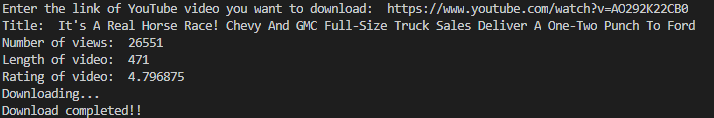

# Summery
This program allows you to download youtube videos and store them on your computer

# Development enviroment
* Python 3.7.8
* Visual sudio code

# Exicution
* to exicute the program `Python Program 2 real, YT dow.py`
 

# Usfull websites
* 
* 